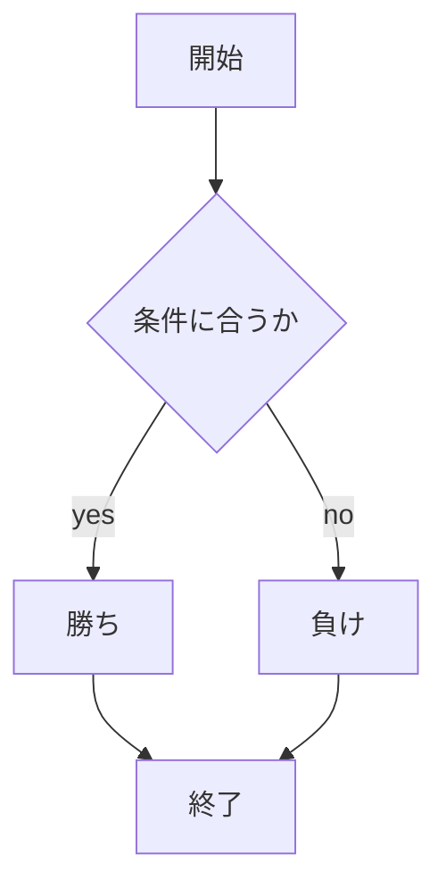

# webpro_06
## このプログラムについて
今回作成したプログラムは，ユーザー側が入力した情報をサーバ側がそれに応じて応答し，入力回数などを記録するというプログラムである．
## ファイル一覧
ファイル名|説明
-|-
app5.js|プログラム本体
public/suji.html|数合わせゲームの開始画面
views/suji.ejs|数合わせゲームの更新後の画面
public/type.html|ポケモンタイプ相性判定の開始画面
views/type.ejs|ポケモンタイプ相性判定の更新後の画面

## 起動方法
###　数合わせゲームの起動方法
1. app5.jsにコードを記入する．
1. ターミナルで以下のようなコードを入力して，サーバを起動する．
```
node app5.js
```
3. その結果，いかの以下のメッセージが返される．
```
Example app listening on port 8080!
```
4. Webブラウザでlocalhost:8080/public/suji.htmlにアクセスする
1. 1から5のうち一つ数字を入力する

###　ポケモンタイプ相性判定の起動方法
1. app5.jsにコードを記入する．
1. ターミナルで以下のようなコードを入力して，サーバを起動する．
```
node app5.js
```
3. その結果，いかの以下のメッセージが返される．
```
Example app listening on port 8080!
```
4. Webブラウザでlocalhost:8080/public/type.htmlにアクセスする
1. ほのおタイプ，くさタイプ，みずタイプのうち一つ入力する
## フローチャート

